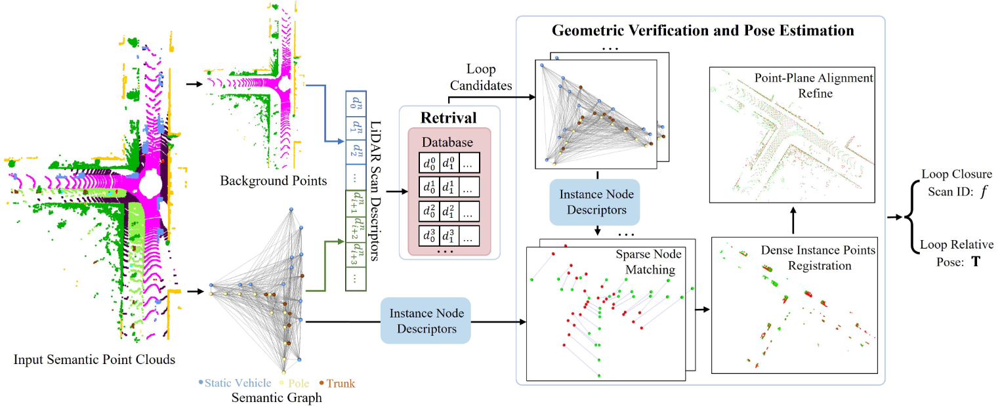
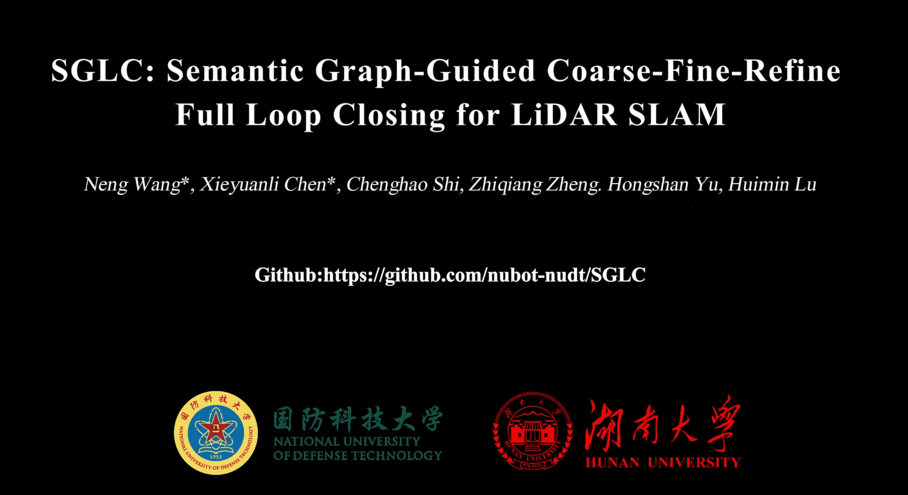

<div align="center">

# SGLC: Semantic Graph-Guided Coarse-Fine-Refine Full Loop Closing for LiDAR SLAM

[](https://neng-wang.github.io/SGLC/) [](https://1drv.ms/f/c/262fa73419fbaa92/Es1dRoIbvBdMpaR3yKjnVpUB-BMc9TOvGyGpW6Rj0ri3sw?e=ZnAl9F) [](https://ieeexplore.ieee.org/document/10750042) [](https://arxiv.org/abs/2407.08106)

</div>

This repo contains the implementation of our paper 

> **SGLC: Semantic Graph-Guided Coarse-Fine-Refine Full Loop Closing for LiDAR SLAM**
>
> [Neng Wang](https://github.com/neng-wang), [Xieyuanli Chen](https://github.com/Chen-Xieyuanli),  [Chenghao Shi](https://github.com/chenghao-shi), Zhiqiang Zheng, Hongshan Yu, Huimin Lu

*SGLC is a semantic graph guided full loop closing framework with robust  loop closure detection and 6-DoF poes estimation.*

If you use our work, please cite the paper:
```bib
@ARTICLE{wang2024ral,
  author={Wang, Neng and Chen, Xieyuanli and Shi, Chenghao and Zheng, Zhiqiang and Yu, Hongshan and Lu, Huimin},
  journal={IEEE Robotics and Automation Letters}, 
  title={SGLC: Semantic Graph-Guided Coarse-Fine-Refine Full Loop Closing for LiDAR SLAM}, 
  year={2024},
  volume={9},
  number={12},
  pages={11545-11552},
  doi={10.1109/LRA.2024.3495455}}
```

## News:

- [2024-11] We release the code of SGLC, which we hope will be of assistance to your research. 

- [2024-10] SGLC is accepted to RAL. :clap:

- [2024-07] Paper is available in arXiv website.

  

# 1. Introduction

### 1.1 Framework

<div align="center">
    <div align="center">
        
    </div>
    <font color=#a0a0a0 size=2>It first builds a semantic graph for foreground instances and then generates LiDAR scan descriptor considering both the topological properties of the semantic graph and the appearance characteristics of the background. The LiDAR scan descriptor is utilized to retrieve loop candidate scans from the database. Following this,  geometric verification is performed on each loop candidate to filter out false loop closure, with the key step utilizing the instance node descriptors for robust sparse node matching. Finally, a coarse-fine-refine registration scheme is employed to estimate the precise 6-DoF pose.</font>
</div>

### 1.2 A related video

You can check it online on this  [link](https://1drv.ms/f/c/262fa73419fbaa92/Es1dRoIbvBdMpaR3yKjnVpUB-BMc9TOvGyGpW6Rj0ri3sw?e=ZnAl9F).

<div align="center">
    <a href="https://1drv.ms/f/c/262fa73419fbaa92/Es1dRoIbvBdMpaR3yKjnVpUB-BMc9TOvGyGpW6Rj0ri3sw?e=ZnAl9F" target="_blank"></a>
</div>

# 2. Prerequisites

We tested our code on **ubuntu 20.04** and **ubuntu 18.04**. 

- **[Eigen](https://gitlab.com/libeigen/eigen/-/releases) (3.3.7)**
- **[PCL](https://github.com/PointCloudLibrary/pcl/releases) (1.10)**
- **[Ceres-solver](https://github.com/ceres-solver/ceres-solver/tags) (2.1.0)**

You need to install these libraries from official guidance.'

# 3. Data

### 1. KITTI

You can download the point cloud dataset from the KITTI official [website](https://www.cvlibs.net/datasets/kitti/), as well as the labels from the semanticKITTI [website](http://semantic-kitti.org/). In our experiments, we use the labels from the SegNet4D. For the convenience, you can download from [here](https://1drv.ms/f/c/5f06ab4eccad8a4e/ErYFBreLgOZHqeWc2-WasIAB6sdME03IipgqzkYuRsTDZg?e=sL1yBr).

Loop pairs: we use the distance-based criteria from the [SSC](https://github.com/lilin-hitcrt/SSC) and overlap-based criteria from [OverlapTransformer](https://github-com-s.libyc.nudt.edu.cn/haomo-ai/OverlapTransformer). You also can download from our [link](https://1drv.ms/f/c/5f06ab4eccad8a4e/ErYFBreLgOZHqeWc2-WasIAB6sdME03IipgqzkYuRsTDZg?e=sL1yBr).

### 2. KITTI360

Download the LiDAR scans from the official [website](https://www.cvlibs.net/datasets/kitti-360/). We provide the labels from SegNet4D.

### 3. Ford campus

You can follow the [OverlapTransformer](https://github-com-s.libyc.nudt.edu.cn/haomo-ai/OverlapTransformer) to download the dataset. We provide the labels on the [link](https://1drv.ms/f/c/5f06ab4eccad8a4e/ErYFBreLgOZHqeWc2-WasIAB6sdME03IipgqzkYuRsTDZg?e=sL1yBr).

### 4. Apollo

We use the Apollo Columbia Park MapData proposed by [AutoMOS](). You can download it from the [MapMOS](https://github.com/PRBonn/MapMOS?tab=readme-ov-file) repository. The semantic labels can be found in the [link](https://1drv.ms/f/c/5f06ab4eccad8a4e/ErYFBreLgOZHqeWc2-WasIAB6sdME03IipgqzkYuRsTDZg?e=sL1yBr).

## 4. Usage

### 4.1 Install

```bash
git clone git@github.com:nubot-nudt/SGLC.git
mkdir build
cd build
cmake ..
make -j8
```

### 4.2 Loop Closure Detection

- **demo data**

```
cd /SGLC/bin
./eval_lcd_pair
```

- **KITTI dataset (distance-based)** 

Modify `config/config_kitti_graph.yaml`

```yaml
eval_seq:
  cloud_path: "xx/kitti/sequences/08/velodyne/" # your LiDAR scans
  label_path: "xx/SegNet4D_predicitions/kitti/sequences/08/predictions/" # semantic predictions from our link
  pairs_file: "../loop_data/pairs/pairs_kitti/neg_100/08.txt" # loop pairs
  out_file: "../out/kitti/08.txt"  # output file for evaluating
```

Then, you can run the `.bin` file following this:

```bash
cd /SGLC/bin
./eval_lcd_seq
```

you can find the output file in the `SGLC/out/`. for evaluating, you can run:

```bash
cd /SGCL/scripts
python pr_curve.py
```

- **KITTI dataset (overlap-based)**

Modify `config/config_kitti_graph.yaml`

```yaml
eval_overlap:
  cloud_path: "xx/kitti/sequences/00/velodyne/"
  label_path: "xx/SegNet4D_predicitions/kitti/sequences/00/predictions/"
  out_pair_file: "../out/kitti/00_overlap_pairs.txt"
  out_pair_veri_file: "../out/kitti/00_overlap_pairs_veri.txt"
```

Then, you can run the `.bin` file following this:

```
cd /SGLC/bin
./eval_overlap
```

For evaluation:

```bash
cd /SGCL/scripts
python eval_overlap_dataset.py --dataset kitti --gt_file loop_gt_seq00_0.3overlap_inactive.npz --preb_file ../out/kitti/00_overlap_pairs_veri.txt
```

Download gt_file from our link in the Data.

- **KITTI-360, Ford_campus and Apollo**

Similarly, follow this KITTI instructions.

Distance-based:

```bash
./eval_lcd_seq_kitti360
```

Overlap-based

```
./eval_overlap_apollo
./eval_overlap_ford_campus
```

### 4.3 Loop Poses Estimation

- **KITTI**

Modify `config/config_kitti_graph.yaml`

```YAML
eval_poses:
  cloud_path: "xx/kitti/sequences/08/velodyne/"
  label_path: "xx/SegNet4D_predicitions/kitti/sequences/08/predictions/"
  loop_poses_file: "xx/loop_data/loop/loop_distance4/08.txt" # gt_file, you can download from our link
  out_file: "../out/kitti/loop_distance4_08.txt" # output file
```

Demo

```bash
cd /SGLC/bin
./eval_loop_poses_pair

#If you want to check the registration results
cd scripts/
python registration_visual.py 
```

For test kitti, run the `.bin` file

```
cd /SGLC/bin
./eval_loo_poses
```

For evaluation:

```bash
cd /SGLC/scripts
python eval_loop_poses.py --dataset kitti --gt_poses xx/loop_data/loop/loop_distance4/08.txt --preb_file ../out/kitti/loop_distance4_08.txt
```

# Acknowledgments

We would like to express our sincere gratitude for the following open-source work that has been immensely helpful in the development of SGLC.

[SSC](https://github.com/lilin-hitcrt/SSC): SSC: Semantic Scan Context for Large-Scale Place Recognition.

[STD](https://github.com/hku-mars/STD/issues): STD: Stable Triangle Descriptor for 3D place recognition.

[KISS-ICP](https://github.com/PRBonn/kiss-icp): KISS-ICP: In Defense of Point-to-Point ICP Simple, Accurate, and Robust Registration If Done the Right Way.

[CVC-Cluster](https://github.com/wangx1996/Lidar-Segementation): Curved-Voxel Clustering for Accurate Segmentation of 3D LiDAR Point Clouds with Real-Time Performance.


# **License**

This project is free software made available under the MIT License. For details see the LICENSE file.
